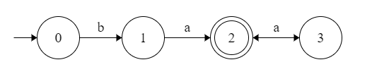
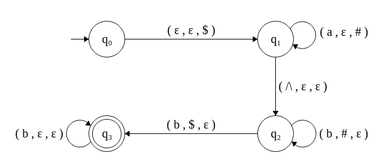
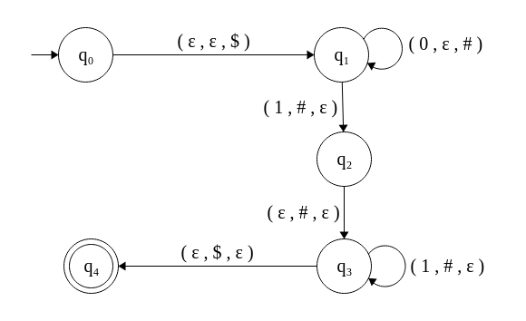

# Context free grammars

Below we have examples of _context free grammars_ and designed automatas that recognize them. The implemented programs ignore any white space, tab and next line symbol fed into the input.

## Grammar descriptions

```console
G1::
S --> bB 
B --> Baa
B --> a
```

The regular expression that defines the language generated by $G_1$ is given by $b(aa)*a$. Converting to a respective _determinisct finite atuomata_ (DFA):




```console
G2::
S --> AB
A --> aAb
A --> ^
B --> Bb
B --> b
```

The language generated by $G_2$ is given by $a^n \wedge b^nb+$. As it is not regular, we need to use a _pushdown automaton_ (PDA) to recognize it. In the below picture we have the constructed PDA with transitions in the form `(read, pop, push)`. An $\epsilon$ stands for the _empty character_.



```console
G3::
S' --> Sc
S  --> SA
S  --> A
A  --> aSb
A  --> ab
```

```console
G4::
S --> E + S
S --> E * S 
S --> E
E --> a
```

```console
G5:: 
S --> 0A1
A --> 0A1
A --> 0
```

Deriving, by applying rules, we see that $\mathcal{L}(G_5) = 0^n01^n \ , \ n > 0$.



## Running the examples

To interact with the recognizer programs:

```console
$ make all
$ ./build/grammar1 # Grammar 1 recognizer.
```
