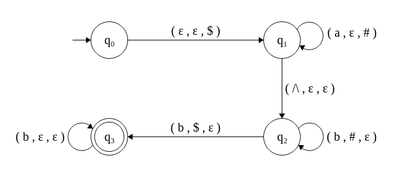

# Context free grammars

Descreva a linguagem gerada pelas gramáticas abaixo e depois implemente um programa reconhecedor da mesma. Podem usar qualquer linguagem, e permitam que entre os simbolos terminais seja possivel ter ou não espaço em branco, tabulação e símbolo da próxima linha.

Describe the languages generated by the following grammars and implement a program that recognizes them. Allow that between terminal symbols it could occur white space, tab and next line symbol.

```console
G1::
S --> bB 
B --> Baa
B --> a
```

The regular expression that defines the language generated by $G_1$ is given by $b(aa)*a$. Converting to a respective _determinisct finite atuomata_ (DFA):


```console
G2::
S --> AB
A --> aAb
A --> ^
B --> Bb
B --> b
```

The language generated by $G_2$ is given by $a^n \wedge b^nb+$. As it is not regular, we need to use a _pushdown automaton_ (PDA) to recognize it. In the below picture we have the constructed PDA with transitions in the form `(read, pop, push)`. An $\epsilon$ stands for the _empty character_.



```console
G3::
S' --> Sc
S  --> SA
S  --> A
A  --> aSb
A  --> ab
```

```console
G4::
S --> E + S
S --> E * S 
S --> E
E --> a
```

```console
G5:: 
S --> 0A1
A --> 0A1
A --> 0
```
